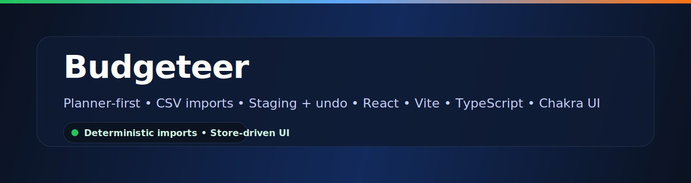

# Budgeteer

[](docs/index.md)
[](CONTRIBUTING.md)

Budgeteer is a privacy-aware personal finance app focused on:

- **Planning-first budgeting** (scenarios + monthly plans)
- **CSV-based transaction imports** (user-controlled; no bank credential scraping)
- **Safe staging/apply/undo** for imports
- **Clear monthly tracking** (planned vs actual)

Key docs:

- Architecture: [docs/ARCHITECTURE.md](docs/ARCHITECTURE.md)
- PRD: [docs/PRD.md](docs/PRD.md)
- Roadmap: [docs/ROADMAP.md](docs/ROADMAP.md)
- Setup: [docs/SETUP.md](docs/SETUP.md)
- API Reference: [docs/API.md](docs/API.md)
- Data Model: [docs/DATA_MODEL.md](docs/DATA_MODEL.md)
- Deployment (Netlify): [docs/DEPLOYMENT_CHECKLIST.md](docs/DEPLOYMENT_CHECKLIST.md)
- Security checklist: [docs/SECURITY_CHECKLIST.md](docs/SECURITY_CHECKLIST.md)
- Risk register: [docs/RISK_REGISTER.md](docs/RISK_REGISTER.md)
- Milestones: [docs/MILESTONES.md](docs/MILESTONES.md)
- Troubleshooting: [docs/TROUBLESHOOTING.md](docs/TROUBLESHOOTING.md)
- Developer Hub: [docs/index.md](docs/index.md)

---

## Project status (Current vs goal)

**Current (baseline is stable):**

- Frontend-only React SPA with Chakra UI + Zustand persisted local domain state.
- Amplify/Cognito auth wired; AppSync GraphQL used primarily for shared backend models (notably `UserProfile`).
- Core budgeting workflows exist:
    - Planner (scenario-based planning)
    - Tracker (planned vs actual)
    - Accounts + CSV import
- CSV ingestion is designed to be deterministic and safe:
    - preview → stage → apply/undo
    - idempotent re-import via a strong transaction key
    - optional streaming parse for large files

**Goal (roadmap direction):**

- Phase 1: tighten product surface coherence (copy/routes/storage keys; remove migration drift).
- Phase 2: type hardening + domain boundaries (split store slices; replace high-risk `any`; add high-value tests).
- Phase 3: Planner/Tracker UX polish (validation, clearer calculations, better empty states).
- Phase 4: ingestion UX/perf enhancements (review tooling, inference UX, performance tuning).
- Phase 5 (optional): cloud sync/backend alignment, gated by privacy constraints and an intentional data ownership model.

**Known issues (current focus):**

- Phase 1 focus is tightening core UX and docs.
- See [TODO.md](TODO.md) for the current backlog and prioritization.

---

## 🛠️ Tech Stack

- React 19 + Vite 7 + TypeScript
- Chakra UI
- Zustand (persisted local state)
- AWS Amplify (Cognito + AppSync) for identity and backend APIs

---

## Getting started

```bash
npm install
npm run dev
```

Vite will choose an available port (typically `http://localhost:5173`, or the next available).

Optional env:

- `VITE_API_BASE_URL` — base URL for any non-AppSync endpoints (if configured)

---

## Available scripts

From `package.json`:

- `npm run dev` — run the dev server
- `npm run check` — lint + test + build (verification)
- `npm run build` — typecheck + production build
- `npm run preview` — preview the production build
- `npm run lint` — run ESLint

---

## Samples (CSV)

Sample CSVs live in the `/samples` folder:

- `samples/sample-transactions.csv` — small curated sample
- `samples/History_07-28-25.csv` — larger history-style export

See `samples/README.md` for format notes and what each file is for.

Expected columns (header required):

- `date` — `YYYY-MM-DD`
- `description`
- `amount` — numeric
- Optional: `type` (`income|expense|savings`), `category`, `balance`

---

## Contributing

See [CONTRIBUTING.md](CONTRIBUTING.md).

The accounts feature accepts CSV with the following columns (header required):

-   date – Transaction date in `YYYY-MM-DD`
-   description – Vendor/description text
-   amount – Number (normalized to absolute value)
-   type – One of `income`, `expense`, `savings`
-   category – Optional free text

Notes:

-   Amounts are normalized to absolute values (`amount`) while the original sign is kept in `rawAmount`.
-   Strong transaction key (used everywhere): `account|date|signedAmount|normalized description[|bal:balance]`.
-   `amount` is stored absolute; `rawAmount` preserves the signed original (used in the strong key signedAmount component).
-   Transactions are sorted ascending by `date` after merge.

Example:

```csv
date,description,amount,type,category
2025-08-03,Walmart Grocery,89.12,expense,groceries
2025-08-05,Paycheck,2450.00,income,salary
2025-08-10,Transfer to Savings,200.00,savings,
```

---

## 🔐 Auth & demo mode tips

-   Tokens are stored in `localStorage.token`.
-   Demo mode: set `localStorage.token = "demo-token"` to sign in as a guest user (never expires).
-   The app checks token freshness on mount and every 5 minutes; expired sessions show a lock overlay with re-login.
-   Cross-tab login refresh is handled via `window.postMessage` and `storage` events; unlocking propagates across tabs.

---

## 🛠️ Troubleshooting

-   Dev server port in use: if `5173` is busy, stop the other process or run with a different port (e.g., `npm run dev -- --port 5174`).
-   Stale local data: in the browser console run `localStorage.removeItem('budgeteer:budgetStore')` to clear persisted store.
-   Session lock persists: visit `/login?bypassLock=true` to re-auth without losing work; successful login clears the lock across tabs.
-   API base URL: if `/me` fails, set a `.env` value like `VITE_API_BASE_URL=https://your-api.example.com` and restart the dev server.
-   CSV import errors: ensure headers match `date,description,amount,type,category` and dates are `YYYY-MM-DD`.
-   Lint/type errors: run `npm run lint` and address reported issues; restart the dev server after large refactors.

## Category Inference (Current & TODO)

## Developer: Metrics Panel & Benchmark Toggle

The import modal includes a metrics panel (timings, duplicate ratio, rows/sec, per‑stage breakdown) automatically after a dry run. For deeper performance analysis you can enable the synthetic ingestion benchmark panel:

1. Go to Settings → Developer section.
2. Toggle "Show Ingestion Benchmark Panel".
3. A fixed panel appears (dev only) allowing you to:
    - Generate synthetic CSVs of arbitrary sizes and duplicate ratios.
    - Simulate streaming (pre-parsed rows path).
    - View per-run wall / ingest / process timings, rows/sec, duplicate %.
    - Capture canonical baselines (5k / 10k / 60k / 100k) via the "Capture Baseline" button.
    - Persist captured baselines in `localStorage` (`ingestionBaselineSnapshots`) for regression comparison; clear them with "Clear Baselines".
    - Export JSON of detailed runs or baselines for historical tracking.

Tip: Use baseline snapshots before and after performance changes (e.g., enabling early dedupe short‑circuit) to quantify impact. Rows/sec = total rows ÷ ingest time (ms) \* 1000.

These are planned follow‑ups to the ingestion category inference system:

-   Immediate inference: provided category (if meaningful) → keyword map (longest first) → regex rules.
-   Consensus pass: vendor root dominance (configurable thresholds) fills unlabeled.
-   Telemetry: per-source counts (`provided`, `keyword`, `regex`, `consensus`, `none`).

Planned enhancements:

-   Dev audit panel (per-transaction inference method) with accept/reject feedback.
-   Custom user-defined rules persisted & merged at runtime.
-   Visual analytics (sparklines / bars) for inference distribution.
-   Historical telemetry aggregation across imports.
-   Tooltips/UI polish for method explanations.

## 🧪 Testing

Run tests (headless):

```bash
npm test
```

Tests currently cover:

1. Transaction normalization edge cases (sign parsing, mixed formats)
2. Strong transaction key formatting & balance inclusion
3. Category inference (immediate + consensus)
4. Strong key utilities (`getStrongTransactionKey`, `getUniqueTransactions`, normalization abs behavior)

Add new tests adjacent to related modules (e.g. `src/ingest/__tests__/`). Keep them fast & deterministic.

## Demo / Data Generation TODOs

-   [ ] Demo CSV generator: Adapt IngestionBenchmark logic to let demo users generate realistic synthetic CSV files (seeded) including:
    -   Recurring paychecks, rent, utilities, subscriptions, groceries, fuel, shopping
    -   Configurable row count (e.g. 500 / 2k / 5k)
    -   Optional duplicate + noise injection
    -   Multi-account output (separate or combined)
    -   Deterministic seed for reproducible walkthroughs
    -   One-click “Generate & Open in Import Modal” action
    -   Future: parameter presets (Light / Typical / Heavy spender)
